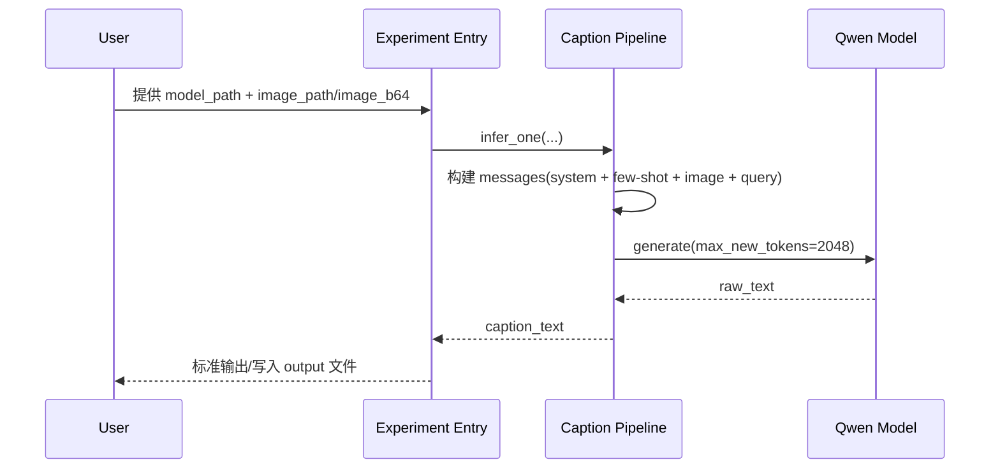
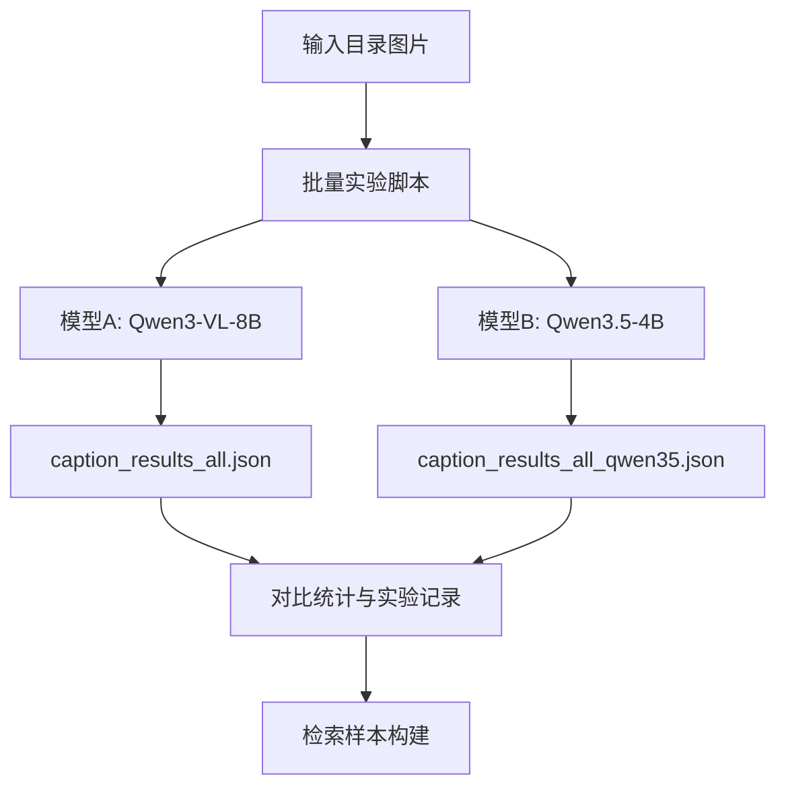

# Retriv 实验设计文档

维护者：zhuangbie@qq.com

## 1. 目标

- 复现单帧图像生成文字描述能力（Image -> Text）。
- 为后续文本检索图片（Text -> Image）预留清晰扩展点。
- 保持实验代码与输入输出结构化管理，便于复用与迭代。

## 2. 模块划分

- `src/experiments/image_to_text_experiment.py`：单帧实验入口。
- `src/pipelines/caption_pipeline.py`：图像描述生成主流程。
- `src/utils/prompt_config.py`：system prompt、few-shot、query 配置。
- `src/utils/image_loader.py`：图片路径与 base64 输入统一处理。
- `src/pipelines/retrieval_pipeline.py`：检索抽象与流水线。
- `src/experiments/text_to_image_retrieval_experiment.py`：检索实验入口占位。

## 3. 数据与结果路径

- 输入：`input/raw/`、`input/processed/`
- 输出：`output/artifacts/`、`output/reports/`
- 文档：`docs/design/`、`docs/guide/`、`docs/spec/`、`docs/dev/`

## 4. Image -> Text 时序

## 5. Text -> Image 扩展方案

- 当前实现保留 `RetrievalBackend` 协议与 `RetrievalPipeline`。
- 后续可接入向量库（FAISS、Milvus、Elastic 向量检索）。
- 建议新增阶段：
  1. 图像向量离线索引构建。
  2. 文本向量在线编码。
  3. 近邻检索与重排。
  4. 检索结果解释与评估报告输出。

## 6. 多模型批量实验设计

- 目标：对同一输入目录进行多模型描述生成，输出统一 JSON 结构。
- 当前模型组：
  - `Qwen3-VL-8B-Instruct`
  - `Qwen3.5-4B`
- 对比指标：
  - 模型加载耗时
  - 平均单图推理耗时
  - 成功率
  - 结果文本可检索性（后续补充自动评估）

## 7. 当前状态

- 已完成 `example_data` 全量 7 张图双模型实验。
- 两模型成功率均为 `100%`。
- `Qwen3.5-4B` 在当前环境中耗时更优。

## 8. 异常与日志约定

- 异常信息：中文，便于快速定位。
- 日志输出：英文，便于检索和统一观测。
